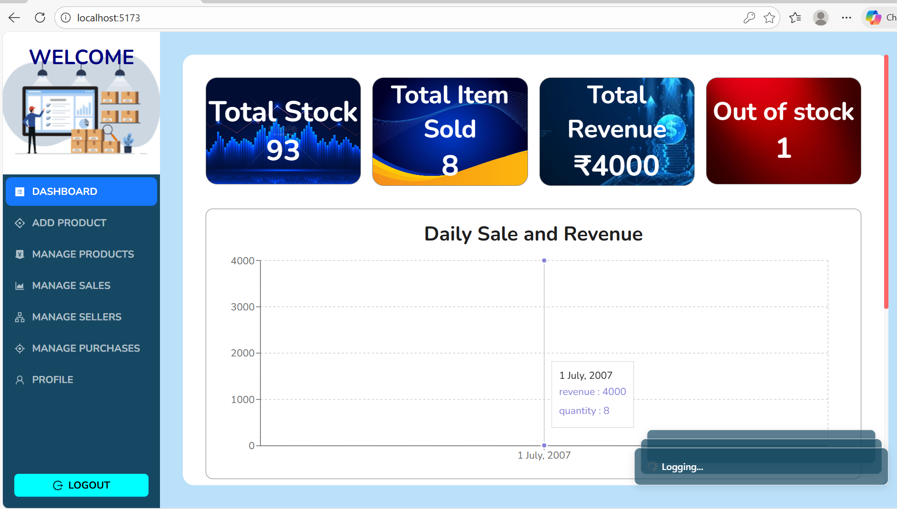
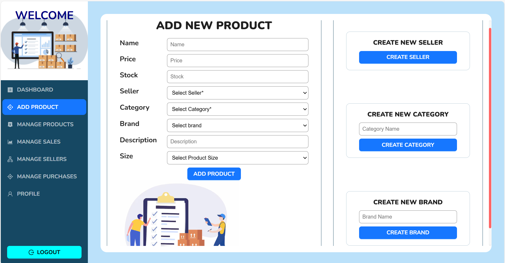

# 📦 Inventory Management System  
A full-stack Inventory Management System built using **React (TypeScript)** and **Node.js (Express + TypeScript)**.  
The system helps businesses manage products, stock, purchases, sales, sellers, and user accounts with authentication and dashboard insights.

---

## 🚀 Features

### 🔐 Authentication
- User registration and login
- JWT-based authentication
- Protected routes
- Secure password change

### 📊 Dashboard
- Total stock
- Items sold
- Total revenue
- Out-of-stock alerts
- Daily & Monthly sales charts

### 🛒 Product Management
- Add product with seller, brand, category, size, price & description
- Search, filter & sort products
- Sell product (reduce stock)
- Add stock (increase stock)
- Edit & delete products

### 💰 Sales Management
- Track sales with buyer name, quantity, total price & date
- Auto-calculation of revenue
- Search sold products
- Delete sales (optional stock adjustment)

### 🧾 Purchase Management
- Record purchases from sellers
- Per-unit cost, quantity & total price
- Due amount tracking
- Stock auto-increases
- Search purchase entries

### 👨‍💼 Seller Management
- Add, view, search & delete sellers
- Linked with product and purchase modules

### 👤 User Profile
- View profile information
- Edit profile
- Change password

---

## 🛠 Tech Stack

### **Frontend**
- React (TypeScript)
- Redux Toolkit + RTK Query
- Vite
- CSS / Tailwind (if used)
- Axios / Fetch

### **Backend**
- Node.js + Express (TypeScript)
- JWT Authentication
- Zod validation
- Modular folder structure
- Middleware-based error handling

### **Database**
- MongoDB / SQL (depending on your setup)

---

## 📂 Project Structure

## 📸 Screenshots

### 🔐 Login Page

### 🏠 Dashboard

### 🛒 Manage Products

